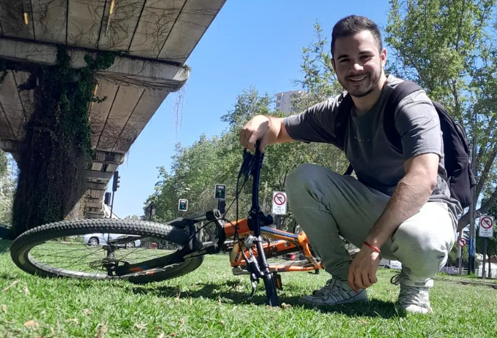
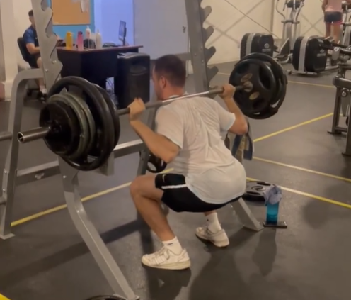

### Hi there 👋

 

    

      Mi nombre es Iván Meneses, tengo 24 años, y soy estudiante de sexto año en Ingeniería Civil Industrial en la FCFM.
    

 
   

 

  

 
 
 
 

 

 

        Me gusta hacer deporte como andar en bicicleta, nadar, pero por sobre todo, me encanta ir al gimnasio.

 
   

       Llevo 4 años entrenando en el gimnasio, y una de mis rutinas favoritas es la de día de pierna. En la imagen de arriba estoy levantando 150 kg en sentadilla libre! :O
   
   

 

  

 
 
 
 

 

   

       Con lo que respecta al área más académica de mi vida, durante los últimos 2 años me he interesado mucho en el mundo del análisis de datos.
   

   
   

       Y es por esta razón, que he estado tomando ramos del Magister de Data Science para adentrarme más en esta área que me apasiona tanto!  

 

  

  
  
  
  

